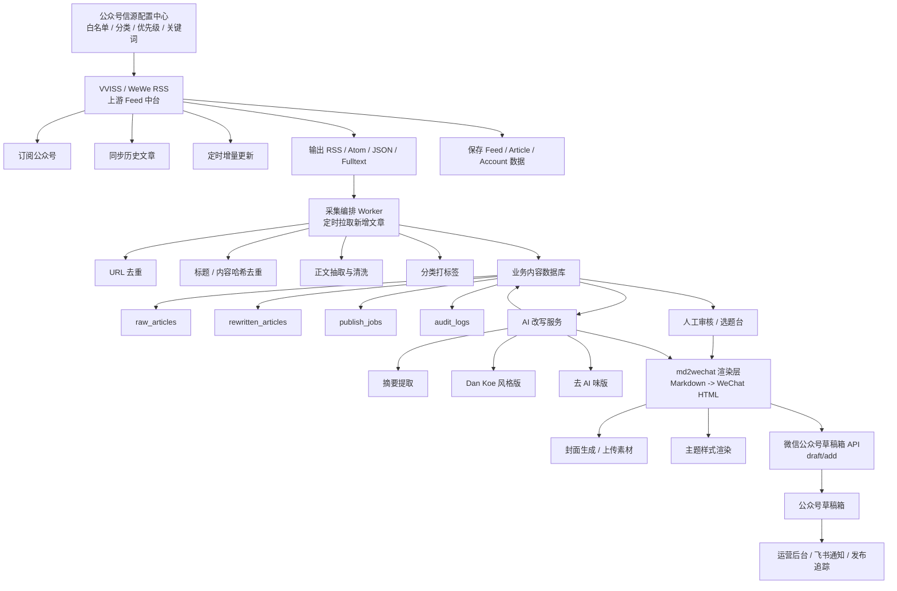
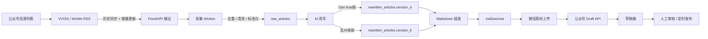
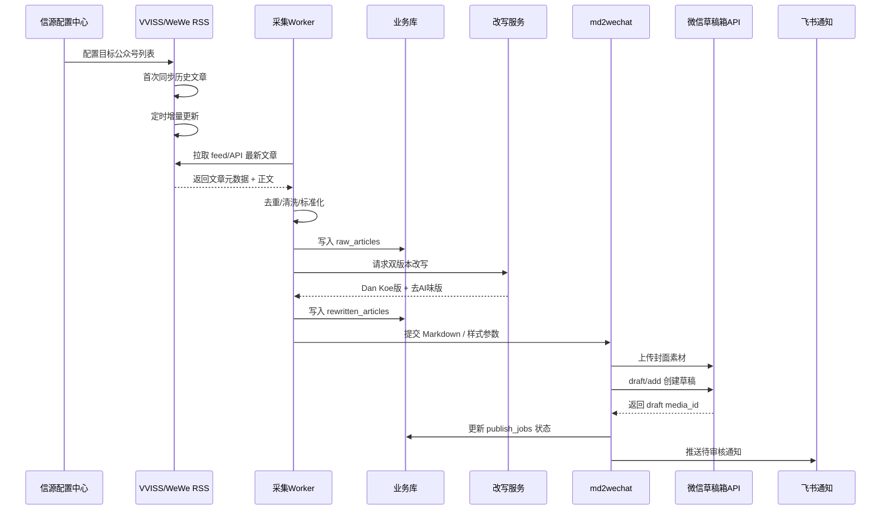

# 公众号内容中台工作流（VVISS / WeWe RSS 上游 Feed 中台版）

> 目标：把WeWe RSS 作为上游公众号 Feed 中台，负责统一订阅、历史同步、增量抓取与全文输出；下游再完成清洗、改写、md2wechat 渲染，并自动推送到公众号草稿箱。

## 1. 设计目标

这个工作流不是把“抓取、改写、发布”硬写死在一个脚本里，而是拆成 5 层：

1. 上游 Feed 中台层：WeWe RSS
2. 采集编排层：拉取新增文章、去重、清洗、入库
3. 内容加工层：摘要提取、双版本改写
4. 微信发布层：md2wechat 渲染 + 微信草稿箱 API
5. 运营控制层：人工审核、飞书通知、失败重试、审计日志

这样做的好处：
- 公众号信源接入和内容生产解耦
- 上游可替换，下游不需要重写
- 历史文章资产掌握在自己手里
- 可以先自动入草稿箱，再人工审核发布
- 故障容易定位，不会一挂全挂

## 2. 已确认的关键事实

基于公开资料和代码结构，已确认：

1. WeWe RSS 适合作为“公众号 Feed 中台”
- 支持微信公众号订阅
- 支持历史文章同步
- 支持后台定时更新
- 支持 RSS / Atom / JSON 输出
- 支持全文输出模式

2. 历史数据不是必须存在第三方云端
- 自建部署时，历史数据保存在你自己的数据库中
- 支持 MySQL（推荐）
- 支持 SQLite（可用，但官方不推荐）
- Prisma schema 中明确存在 Feed / Article / Account 表

3. md2wechat 适合作为下游渲染与草稿上传组件
- Markdown / HTML 可转公众号图文格式
- 可上传封面图到微信素材库
- 可调用微信公众号 draft/add 创建草稿

## 3. 系统定位

推荐定位：

WeWe RSS = 上游内容接入中台
你的 workflow = 内容生产与发布中台

边界划分：

WeWe RSS 负责：
- 公众号订阅
- 历史文章抓取
- 增量更新
- feed 输出
- 全文内容输出
- 基础存档

你的 workflow 负责：
- 信源策略
- 数据拉取
- 去重清洗
- 标签分类
- 摘要抽取
- Dan Koe 版改写
- 去 AI 味版改写
- Markdown 生成
- md2wechat 渲染
- 上传公众号草稿箱
- 审核与通知

## 4. 总体技术架构图



## 5. 核心数据流



## 6. 文章处理时序图



## 7. 模块职责拆分

### 7.1 信源配置中心

维护一份公众号 source registry，建议字段：
- source_id
- source_name
- category
- priority
- enabled
- need_history_sync
- sync_frequency
- include_keywords
- exclude_keywords
- owner
- note

作用：
- 控制抓哪些号
- 按分类路由到不同下游策略
- 决定是否抓历史文章
- 决定优先级和更新频率

### 7.2 VVISS / WeWe RSS 上游中台

建议职责：
- 统一接入所有公众号
- 管理抓取账号 / 订阅源
- 同步历史文章
- 按 cron 增量更新
- 对外提供统一 feed/API
- 保留基础抓取存档

建议部署：
- 生产环境优先 MySQL
- 测试环境可用 SQLite
- 独立容器部署
- 不与改写服务混部署

### 7.3 采集编排 Worker

建议职责：
- 定时轮询 VVISS feed/API
- 只拉最近窗口内新增文章
- 标准化字段
- 去重
- 清洗正文
- 落业务库
- 投递改写任务

建议去重策略：
- upstream article_id 去重
- source_url 去重
- normalized_title 去重
- content_hash 去重

### 7.4 内容加工层

建议输出两个强制版本：

版本 A：Dan Koe 风格改写版
- 更强观点密度
- 更强结构感
- 更适合选题化、观点化表达

版本 B：去 AI 味版
- 基于 A 再次处理
- 更口语化、更自然
- 减少模板痕迹
- 更适合作为最终公众号草稿

### 7.5 md2wechat 渲染层

建议职责：
- Markdown 转公众号 HTML
- 应用统一主题样式
- 处理图片上传与替换
- 上传封面素材
- 调用微信 draft/add 创建草稿

### 7.6 运营控制层

建议职责：
- 人工审核
- 飞书通知
- 失败重试
- 审计日志
- 发布记录追踪

## 8. 数据存储设计

不要直接把 VVISS 的数据库当业务主库。

推荐双库：
- 上游库：VVISS 自己的 Feed / Article / Account 数据
- 业务库：你自己的 raw_articles / rewritten_articles / publish_jobs

### 8.1 上游库（VVISS 自带）

已知核心实体：
- Account
- Feed
- Article

作用：
- 管理订阅源
- 记录抓取进度
- 记录基础文章元数据

### 8.2 业务库（建议新增）

#### sources
- id
- name
- platform
- upstream_feed_id
- feed_url
- category
- priority
- enabled
- created_at
- updated_at

#### raw_articles
- id
- source_id
- upstream_article_id
- title
- author
- source_url
- publish_time
- cover_url
- raw_html
- raw_text
- content_hash
- tags_json
- status
- fetched_at
- created_at
- updated_at

#### rewritten_articles
- id
- raw_article_id
- version_type
- title
- markdown_content
- html_content
- prompt_version
- model_name
- status
- created_at
- updated_at

#### publish_jobs
- id
- rewritten_article_id
- channel
- draft_media_id
- thumb_media_id
- status
- error_message
- created_at
- updated_at

#### audit_logs
- id
- entity_type
- entity_id
- action
- detail_json
- created_at

## 9. 统一文章数据结构

建议你的中间层统一输出为：

```json
{
  "source_id": "mp_openai_daily",
  "source_name": "某公众号",
  "upstream_article_id": "article_xxx",
  "title": "文章标题",
  "author": "作者名",
  "publish_time": "2026-04-25T08:30:00+08:00",
  "source_url": "https://mp.weixin.qq.com/s/...",
  "cover_url": "https://...jpg",
  "raw_html": "<p>...</p>",
  "raw_text": "正文纯文本",
  "content_hash": "sha256:...",
  "tags": ["AI", "OpenAI", "模型发布"],
  "fetched_at": "2026-04-25T09:00:00+08:00"
}
```

## 10. 状态机设计

推荐状态流：

```text
discovered
  -> fetched
  -> cleaned
  -> deduped
  -> queued_for_rewrite
  -> rewritten_dankoe
  -> rewritten_humanized
  -> ready_for_review
  -> draft_created
  -> published
```

异常状态：

```text
fetch_failed
rewrite_failed
draft_failed
review_rejected
```

## 11. 推荐部署形态

### 11.1 最推荐：解耦生产版

组件：
- vviss / wewe-rss 容器
- mysql
- workflow worker（Python）
- 业务数据库（MySQL 或 SQLite）
- md2wechat 运行环境
- 飞书 webhook

优点：
- 职责清晰
- 易扩展
- 易排障
- 数据资产可控

### 11.2 轻量 MVP 版

组件：
- vviss / wewe-rss
- python cron 脚本
- sqlite 业务库
- md2wechat

优点：
- 上线快

缺点：
- 状态管理较弱
- 并发与重试能力一般

## 12. 推荐目录结构

考虑到终端在中文 workdir 下容易出问题，执行根目录建议继续使用英文路径，业务输出目录保持中文。

推荐：`~/.hermes/wechat-article-workflow/`

```text
~/.hermes/wechat-article-workflow/
├── config/
│   ├── sources.yaml
│   ├── workflow.yaml
│   └── prompts/
│       ├── dankoe.md
│       └── humanize.md
├── data/
│   ├── business.db
│   ├── cache/
│   └── exports/
├── docs/
│   └── 公众号内容中台工作流.md
├── logs/
├── scripts/
│   ├── pull_from_vviss.py
│   ├── clean_articles.py
│   ├── rewrite_articles.py
│   ├── render_md2wechat.py
│   └── push_draft.py
├── output/
│   └── YYYY-MM-DD/
│       ├── 原文快照/
│       ├── DanKoe版/
│       ├── 去AI味版/
│       └── 草稿HTML/
└── tmp/
```

## 13. MVP 实施步骤

### 阶段 1：搭上游 Feed 中台
- 部署 VVISS / WeWe RSS
- 接入首批 10~20 个目标公众号
- 验证历史同步是否成功
- 验证增量更新是否正常
- 验证 RSS / JSON / Fulltext 可读

### 阶段 2：搭采集编排层
- 编写 pull worker
- 拉取最近新增文章
- 写入 raw_articles
- 增加去重和正文清洗
- 生成统一结构化数据

### 阶段 3：搭改写层
- 编写双版本改写流程
- 强制输出 Dan Koe 版 + 去 AI 味版
- 持久化改写结果
- 记录 prompt 版本和模型版本

### 阶段 4：搭草稿上传层
- 接入 md2wechat
- 处理封面素材上传
- 调用 draft/add 创建草稿
- 记录 draft_media_id

### 阶段 5：搭审核与通知层
- 飞书推送待审核消息
- 后台查看原文与改写稿
- 记录失败日志和重试结果

## 14. 关键设计原则

1. 上游采集和下游生产必须解耦
2. 一定保留原文快照，避免上游内容变化导致不可复现
3. 不只按 URL 去重，要加标题归一化和内容哈希
4. 自动入草稿箱可以，自动群发先不要做
5. 所有文章都必须保留原始来源链接
6. 数据真实性优先，抓不到就如实失败，绝不模拟

## 15. 风险与注意事项

### 15.1 抓取源稳定性
- 公众号抓取本身有上游变化风险
- 需要预留重试和熔断机制
- 需要监控源失效情况

### 15.2 正文清洗不稳定
- 公众号尾部模板、推荐阅读、广告区块经常变化
- 清洗规则要可配置，不要硬编码死

### 15.3 微信草稿接口限制
- 标题、摘要、内容长度都有限制
- 图片需先转素材并拿 media_id
- 封面图尺寸、比例要符合规则

### 15.4 审核合规
- 自动改写必须保留原始来源记录
- 需要支持人工终审
- 不建议直接全自动发布

## 16. 结论

最终推荐架构：

- VVISS / WeWe RSS 作为上游 feed 中台
- 你的 Python workflow 作为中游编排与加工层
- md2wechat + 微信 Draft API 作为下游发布层
- 飞书作为审核和通知入口

这套架构适合你的原因：
- 可持续扩源
- 可持续积累历史文章资产
- 可稳定输出双版本改写内容
- 可与公众号草稿箱自然衔接
- 可先自动化 80%，把最后发布决策保留给人工

## 17. 下一步建议

建议下一步直接进入实施文档与脚本骨架阶段：

1. 写 `sources.yaml` 设计
2. 写 `workflow.yaml` 设计
3. 写业务库 schema
4. 写 `pull_from_vviss.py` 骨架
5. 写 `rewrite_articles.py` 骨架
6. 写 `push_draft.py` 骨架

如果你要，我下一步可以直接继续把这个方案落成：
- 一套可执行的目录骨架
- 配置文件模板
- SQLite schema
- 3~5 个核心脚本骨架
